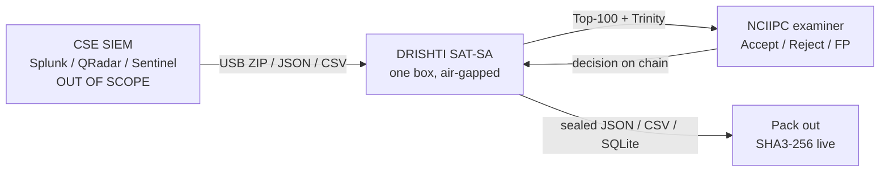
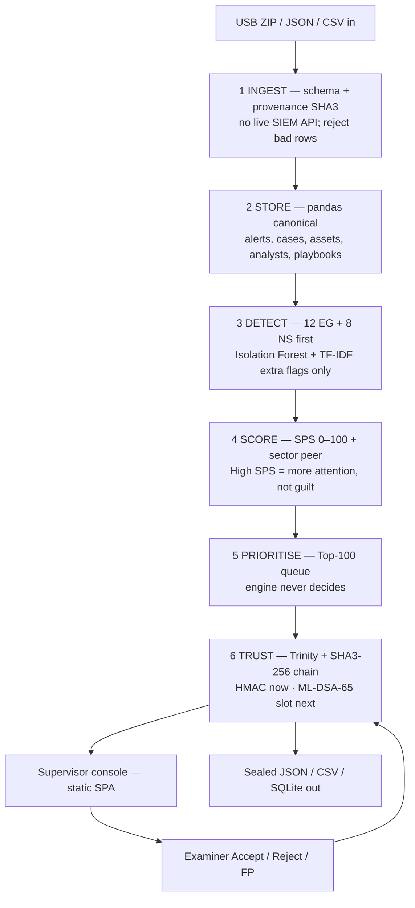
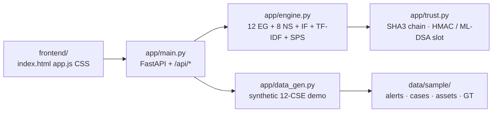
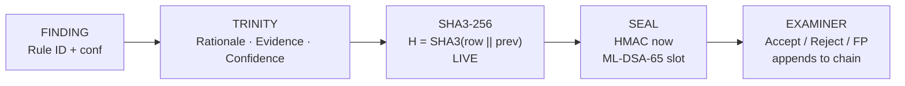

# DRISHTI SAT-SA — Architecture (PS 26157)

**Team CYBERNOVA2026 · SIH 2026 · Offline explainable supervisory analytics for NCIIPC**

**One line:** DRISHTI sits *after* the CSE SIEM. SHA3-256 is **live**. ML-DSA-65 is **next**. The engine never closes a ticket.

This file is the website / GitHub architecture page. The SIH portal PDF (max 2 pages) is `ARCHITECTURE.pdf`.

---

## 1. Purpose and boundary

NCIIPC already receives SOC *output*. SAT-SA judges whether that output is *work*. DRISHTI does not monitor live, collect telemetry, or replace Splunk / QRadar / Sentinel. Examiners **Accept / Reject / FP** every queued finding.

| In | Out of scope |
|----|----------------|
| USB ZIP / JSON / CSV (alerts, cases, assets — metadata only) | CSE SOC floor, real-time monitoring |
| Dashboard + sealed JSON / CSV / SQLite | SIEM replacement, live Splunk/QRadar API |
| SHA3-256 hash chain (HMAC now) | Cloud LLM, SaaS, hosted models |
| Human examiner on Top 100 | National sensor grid, pcaps / PII / raw logs |

**Offline contract:** no internet, no cloud, no CDN. `docker run --network=none`. CPU only — **no GPU**.

---

## 2. System context

DRISHTI is not a blockchain ledger. The trust layer is a **hash chain** (FIPS 202 SHA3-256 live; FIPS 204 ML-DSA-65 is the next seal slot, not shipping).

---

## 3. Six-layer pipeline

Data is ingested at the bottom and presented upward to the examiner.

| Layer | What happens |
|-------|----------------|
| Ingest | Schema check, provenance hash, no raw logs / PII |
| Store | Alerts, cases, assets, analysts, playbooks, compliance |
| Detect | Deterministic rules first (auditable); ML only as an extra flag |
| Score | Capability concern rates → SPS; peer by sector |
| Prioritise | 100 rows a person can finish; engine never decides |
| Trust | Rationale, evidence ids, confidence, SHA3-256 (ML-DSA-65 slot) |

---

## 4. Deployment (one box)

**Runtime:** Python 3.11, FastAPI, pandas, scikit-learn. UI = static SPA, relative `/api/*`, no npm, no CDN. Hardware: 4 vCPU, 16 GB RAM, 100 GB SSD, **no GPU**.

---

## 5. Dual engine (PS §3)

Rules fire **first**. Isolation Forest and TF-IDF are extra flags, never the verdict.

### A. Execution gaps — KPI contradicted by evidence

| ID | Signal | Conf |
|----|--------|------|
| EG-01 | Critical, dwell&lt;10, steps&lt;2, no escalation | 0.90 |
| EG-02 | Critical closed, no escalation | 0.85 |
| EG-03 | TF-IDF cosine &gt; 0.95, same analyst | 0.91 |
| EG-04 | Same asset+type ≥5 times, no RCA | 0.80 |
| EG-05 | Critical asset, 0 alerts, peers noisy | 0.93 |
| EG-06 | Fast MTTR + templates + low escalation | 0.88 |
| EG-07 | Critical/High, 0 investigation steps | 0.82 |
| EG-08 | Escalation after SLA | 0.75 |
| EG-09 | Critical notes &lt;20 chars | 0.70 |
| EG-10 | Malware closed without evidence | 0.80 |
| EG-11 | Dwell exceeds severity SLA | 0.75 |
| EG-12 | Analyst load &gt;3× team median | 0.65 |

### B. Negative space — expected evidence missing

| ID | Signal |
|----|--------|
| NS-01 | Silent critical asset |
| NS-02 | Missing MITRE / category vs sector |
| NS-03 | Zero critical escalations |
| NS-04 | Volume &lt; 10% of peer median |
| NS-05 | Silent analyst |
| NS-06 | Missing control evidence |
| NS-07 | No night / weekend alerts |
| NS-08 | Critical-asset coverage gap |

### C. ML flags (PS §5) — never the verdict

sklearn `IsolationForest` n=200, contamination=0.15 on `(MTTR, escalation_rate, investigation_steps, silent_rate, fast_critical, night_rate)`. Fit on **this extract only**. TF-IDF cosine &gt; 0.95 for templates. Update = USB re-ingest. No cloud model, no GPU.

---

## 6. Trust chain

Production swap is HMAC → **ML-DSA-65** in the same slot. It is not shipping in this build.

---

## 7. SPS, queue, demo

Eight NCIIPC capabilities: Detection 20%, Investigation 20%, Escalation 15%, IR 15%, SecOps 10%, Governance 10%, Discipline 5%, Resilience 5%.

**SPS = weighted concern rate. High = more examiner attention, not guilt.** Sector trimmed median (10% tails). Peer flag when Z &gt; 2.

Queue score = `confidence × severity_weight × (1+cap_weight) × (1+0.15|z|)` with a per-rule cap so Top 100 is not 100 copies of EG-01.

**Demo extract (measured on this build):** 12 CSEs · 3,378 alerts · 235 findings · Top 100. Planted `ground_truth.csv` recovered **38 / 40**. Design target F1&gt;0.85 is for a larger labelled extract — **not** claimed as a result of this demo. Not an NCIIPC production deployment.

---

## 8. What this is not

Not a CSE SOC design, not a live SIEM integration, not a blockchain ledger, not a claim that ML-DSA-65 or F1&gt;0.85 is shipping.
